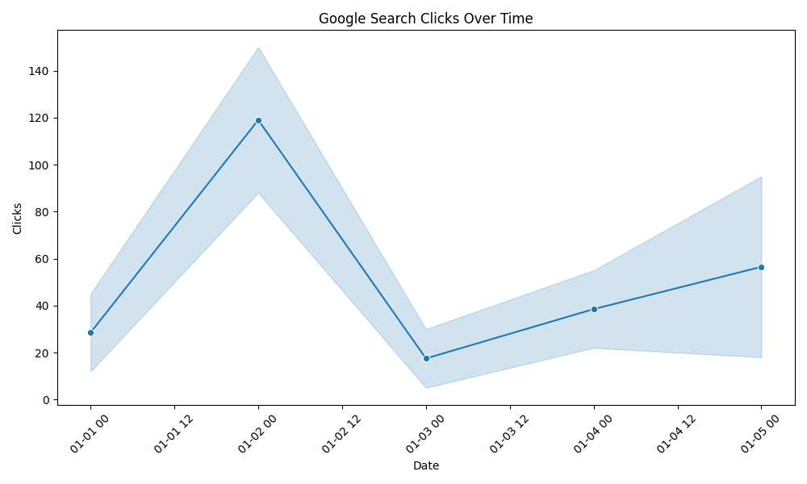

📊 Google Search Analysis Project

🔍 Overview
This project analyzes Google search trends using Python to identify patterns, growth rates, and popular topics.

🚀 Features
- Data collection using Google Trends API
- Data cleaning and preprocessing
- Trend analysis
- Visualization of search interest

🛠 Tech Stack
- Python
- Pandas
- Matplotlib
- Pytrends

 📈 Insights
- Identifies trending topics
- Compares growth rates of search queries

 ▶️ How to Run
```bash
pip install -r requirements.txt
python main.py

## Data Visualization (Sample Output)
Below is the trend analysis generated by the pipeline:



*This chart shows the total clicks over time, helping identify peak performance days.*
